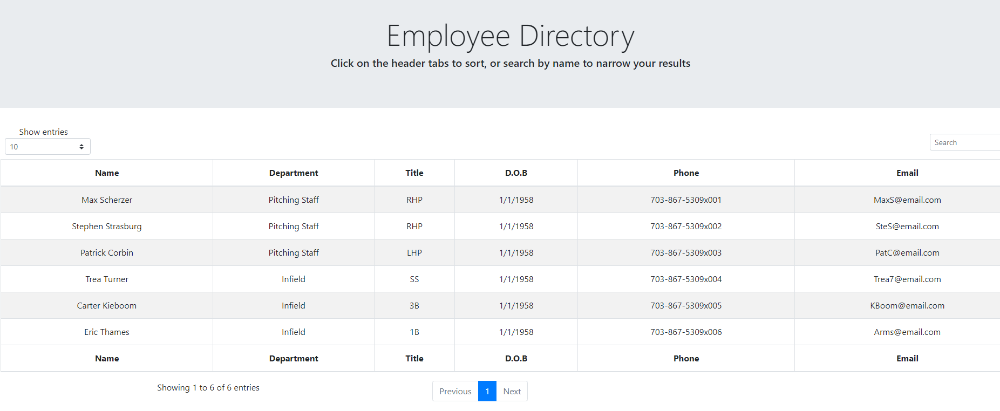

# Unit 19 React Homework: Employee Directory


```

# React Employee Directory

Here is an employee directory created with React. The app's parts are the React components in action showcasing component state and user event responses

The business context was the following
```
An employee or manager would benefit greatly from being able to view non-sensitive data about other employees. It would be particularly helpful to be able to filter employees by name.
``` 
  

## License
  
MIT License 

## Table of Contents

* [Installation](#Installation)  
* [Usage](#Usage)  
* [License](#License)  
* [Contributing](#Contributing)  
* [Contact](#Contact)  

## Installation
```bash
npm i
```
## Usage
Please visit the deployed application link.  

## Contributing

Open to collaboration and criticism. Please email for PR. 

## Contact
For any questions and suggestions, please feel free to contact me at the following platforms:
* GitHub: WRXjasonSTI 
* Email: jasoncruz_rocks@gmail.com 

##
MIT License 
Copyright WRXjasonSTI
    